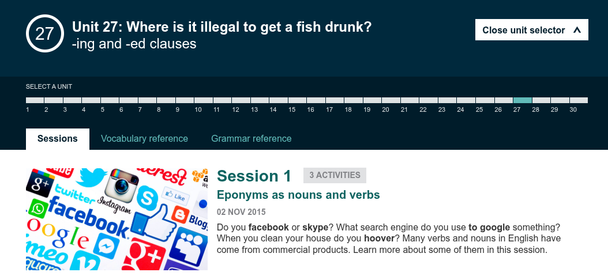
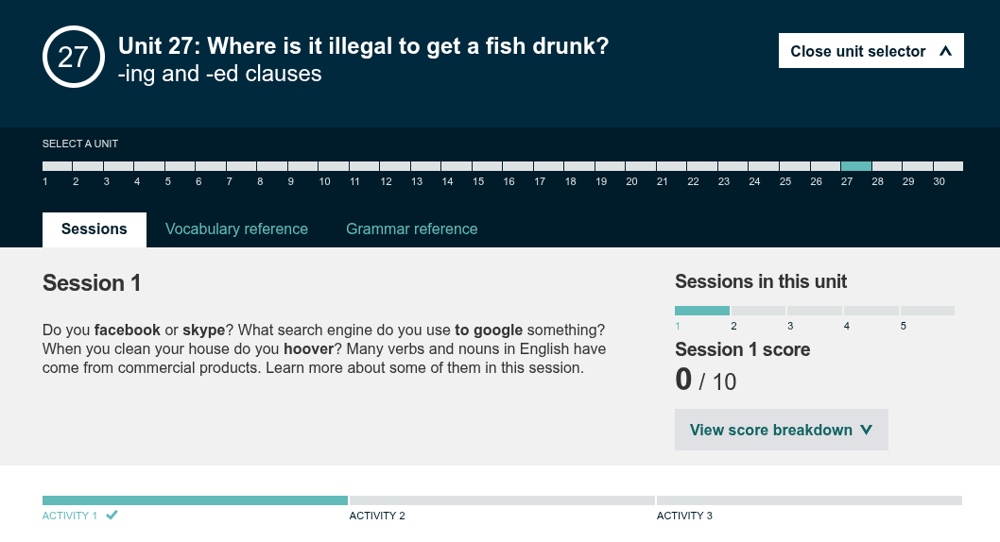
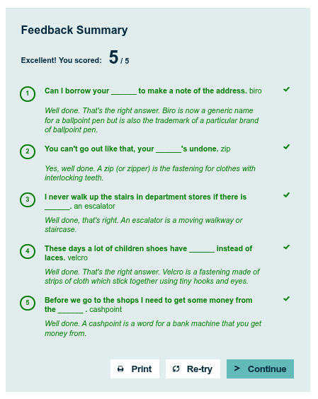
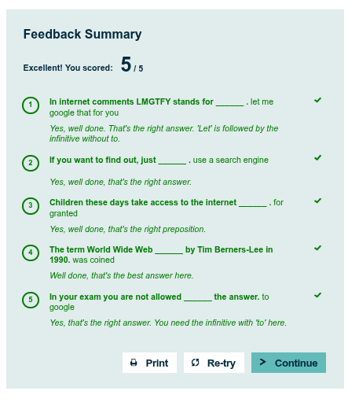

# Bonus Lab - Reading Session

## Unit 27 - Session 1: Eponyms as Nouns and Verbs

---

## Words:

### 1. eponiyms

> **Tebakan arti:** mirip persamaan kata, sinonyms?

> **Arti sebenarnya:** kata yang berasal dari nama seseorang atau sesuatu yang kemudian digunakan sebagai nama suatu benda, konsep, atau istilah.

> **Contoh kalimat:** Some words in English are eponyms that come from people's names.

### 2. xeroxing

> **Tebakan arti:** mencetak, membaca dokumen?

> **Arti sebenarnya:** memfotokopi atau menggandakan dokumen. Berasal dari nama merek Xerox.

> **Contoh kalimat:** She was xeroxing some documents for the meeting.

### 3. hoovering

> **Tebakan arti:** menyapu, membersihkan

> **Arti sebenarnya:** membersihkan atau menyedot debu menggunakan vacuum cleaner. Berasal dari merek Hoover.

> **Contoh kalimat:** He is hoovering the carpet.

### 4. proprietary

> **Tebakan arti:** properti, milik pibadi, hak milik

> **Arti sebenarnya:** dimiliki oleh orang atau perusahaan tertentu; bukan sesuatu yang bebas digunakan atau dimiliki oleh umum.

> **Contoh kalimat:** The company uses proprietary software.

### 5. trademark

> **Tebakan arti:** merk, merk dagang

> **Arti sebenarnya:** merek dagang yang dilindungi secara hukum, seperti nama, logo, atau simbol yang digunakan untuk membedakan suatu produk atau layanan.

> **Contoh kalimat:** The company registered its name as a trademark.

### 6. brand

> **Tebakan arti:** produk, sesuatu yang baru

> **Arti sebenarnya:** merek atau identitas yang digunakan untuk membedakan produk atau layanan dari produk atau layanan lain.

> **Contoh kalimat:** This is a popular brand of soft drinks.

> *Brand = identitas merek; Trademark = tanda/merek yang memiliki perlindungan hukum.*

### 7. fizzy

> **Tebakan arti:** segar? terkarbonasi, pusing?

> **Arti sebenarnya:** mengandung gelembung gas, terutama digunakan untuk minuman berkarbonasi.

> **Contoh kalimat:** I would like a fizzy drink.

### 8. for granted

> **Tebakan arti:** diberikan, yang sudah ada, selayaknya

> **Arti sebenarnya:** menganggap sesuatu sebagai hal yang sudah pasti tersedia atau akan selalu ada, sehingga tidak menghargainya dengan cukup.

> **Contoh kalimat:** We should not take clean water for granted.

### 9. infancy

> **Tebakan arti:** bentuk awal, belum sempurna

> **Arti sebenarnya:** tahap awal perkembangan sesuatu; masih dalam tahap awal dan belum berkembang sepenuhnya. Secara literal, infancy berarti masa bayi.

> **Contoh kalimat:** The technology is still in its infancy.

### 10. coined

> **Tebakan arti:** mencetuskan, mengusulkan

> **Arti sebenarnya:** menciptakan atau memperkenalkan kata atau istilah baru.

> **Contoh kalimat:** The term was coined to describe a new phenomenon.

---

## Activity

